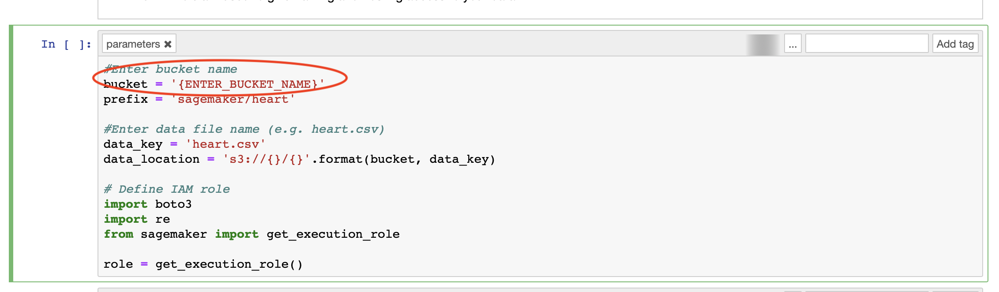
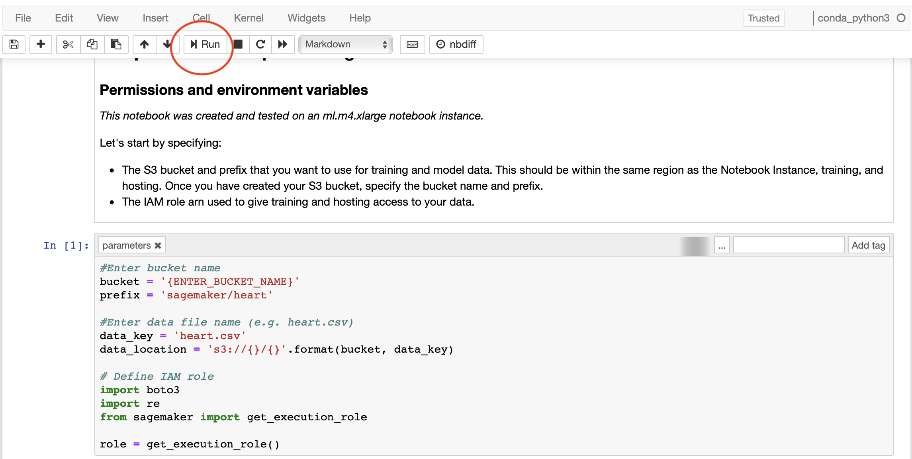
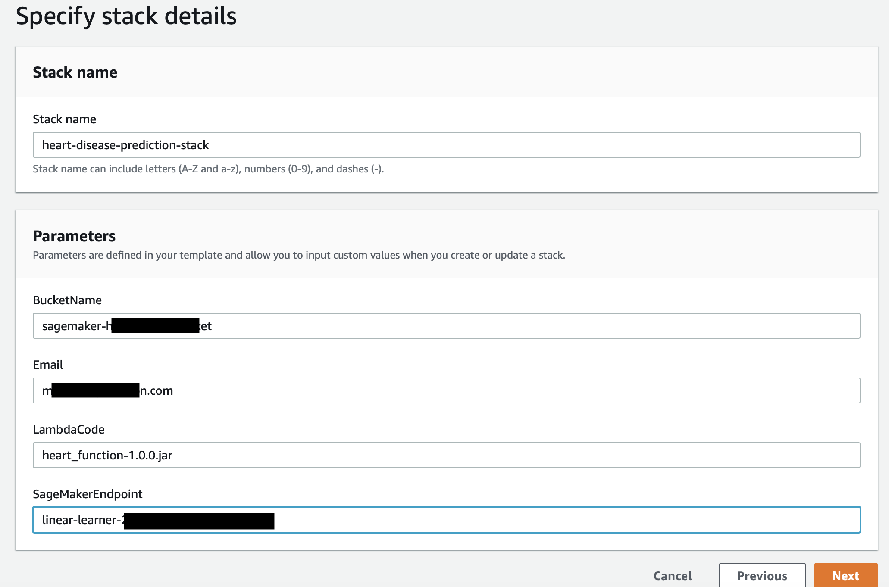
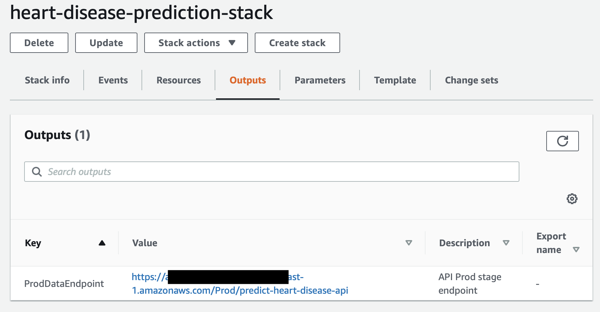
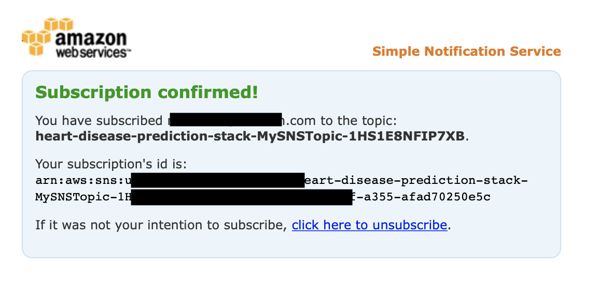
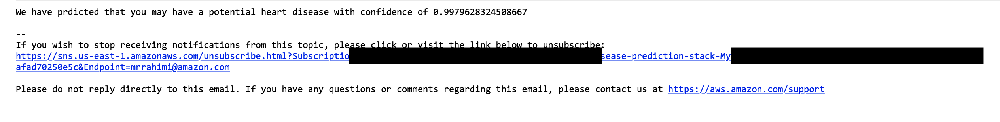

## AWS SageMaker Heart Disease Prediction 

Machine learning can potentially play a significant role in helping doctors and scientists predict heart disease.  A person’s chance of having a heart disease includes many factors such as diabetes, high blood pressure, high cholesterol, abnormal heart rate, and age.  In this sample, you will use AWS SageMaker to train a linear learner algorithm that can potentially predict the presence of heart disease.   

Note: This is only a sample application and should not be considered as medical advice.

## Architecture

The architecture for this workshop is the following:

## Description

This project uses Cleveland Heart Disease dataset taken from the UCI repository.  The dataset consists of 303 records that measure an individual features (age, heart rate, sex, blood pressure, etc.).  As depicted above, you will first use SageMaker’s linear learner algorithm to train and deploy a model.  Once the model is deployed, you can use AWS API Gateway to get real time prediction for a set of data.  If the model predicts the presence of heart disease, an SNS notification is sent to the user e-mail address.

## Quick Start
The quick start guide is intended to deploy the sample application in your own AWS account using a cloud formation template.

Quick Start Setup

Prerequisites:
1.	Sign-in to AWS or Create an Account
2.	Create an AWS Bucket
a.	Note: please make sure your bucket name starts with ‘sagemaker’.  This allows SageMaker to access your bucket.
b.	Make a note of the region.  Make sure all services used are in the same region as your bucket.
3.	Upload ‘heart.csv’ file located in project /src/test/resources directory to your AWS Bucket.  
4.	Upload packaged code ‘heart_function-1.0.0’ provided in root directory to your AWS Bucket.

Training SageMaker Model
In this section, we will use AWS SageMaker to import the sample jupyter notebook and train a model that can predict heart disease.  Once the model is trained, it will be hosted directly on SageMaker. 

1.	Using AWS Console, select Amazon SageMaker from the list of AWS Services.
2.	In SageMaker console, select Notebook instances from the left navigation panel

 

3.	Select create notebook instance
4.	Enter a name for your notebook.  Keep all other fields as default. 

5.	Click on Create notebook instance
6.	Once notebook instance is ‘In Service’, click on Open Jupyter.
7.	Click Upload
8.	Choose heart-disease-prediction.ipynb
9.	Click on Upload again to confirm

10.	Click on heart-disease-prediction.ipynb to open the file
11.	Scroll down to the first section that contains code and enter the bucket name that you had created earlier.

12.	Once the bucket name is replaced, Click Run

13.	When a cell blocks finishes execution, a number is displayed next to the cell.  Continue clicking on Run on each cell block.  
Note: Training and deploying the model take the longest time.

14.	After you have hosted your model, copy the endpoint name.  You will use this endpoint name when launching cloud formation.

15.	You can continue to execute the remaining cell blocks to get a prediction on SageMaker notebook.  
Warning: Do not execute the ‘(Optional) Delete the endpoint’.

### Launch cloud Formation

In this section, you will launch a cloud formation template that performs the following:
- Creates API Gateway
- Creates a lambda function that calls SageMaker endpoint
- Creates an SNS notification that sends e-mail

1.	Using AWS Console, select ‘CloudFormation’ from the list of AWS Services.
2.	Choose ‘Create Stack’.  
3.	Select ‘Template is ready’ and ‘Upload a template file’
4.	Choose ‘cloud_formation_template.yaml’ file located in project root directory.
5.	On the next page, specify stack details
   a.	Choose a stack name
   b.	Specify your bucket name (this is the bucket you created earlier)
   c.	Specify Email address.  This email address is used to send you notification if heart disease is predicted.
   d.	Specify the uploaded lambda code (this is the code you uploaded)
   e.	Specify the SageMaker endpoint (this is the endpoint you copied earlier)

6.	Click Next
7.	On subsequent pages, leave all other fields to their default values and click Next. 
8.	On the final page, acknowledge all ‘Transform might require access capabilities’
9.	Choose Create Stack
10.	Once the Stack is successfully created, click on Output tab
11.	Copy the prodDataEndpoint value.  This is the API Gateway endpoint used for real time predictions.

### Predicting Heart disease in real time

The cloud formation template has created an endpoint that can be invoked in real time to predict heart disease.  We will use the sample data below to get a prediction of heart disease.

Example data:
You can use API Gateway console, postman, or simple curl command to invoke your API in real time.  Below is an example curl command to get heart disease prediction in real time.

curl -d ‘{"age": "23","sex": 1,"cp": 3,"trestbps": 145,"chol": 233,"fbs": 1,"restecg": 0,"thalach":150,"exang": 0,"oldpeak": 2.3,"slope": 0,"ca": 0,"thal": 1}’ -X POST {ENTER_API_GATEWAY_ENDPOINT};

The above call should return a real time prediction:

 

Note: When prediction label is 1, a notification e-mail is also sent.  You may have to first confirm the subscription of your e-mail.

Be sure to:

* Change the title in this README
* Edit your repository description on GitHub

## License

This library is licensed under the MIT-0 License. See the LICENSE file.

